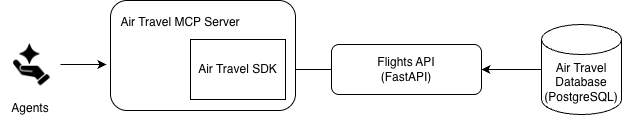

# ✈ NERDEARLA 2026 - Async APIs and MCP with Python ✈

This repository contains the code used for my **NERDEARLA 2026** speaking session.

The project uses air travel data to demonstrate how asynchronous Python can be used to build modern data services, including:

- an asynchronous REST API with FastAPI
- an asynchronous Python SDK/client
- an MCP server built with FastMCP
- shared async HTTP workflows using HTTPX
- PostgreSQL-backed data access

The goal of the project is not to build a complete production air travel platform. Instead, it provides a realistic example for exploring how async programming fits across an API and MCP architecture.

As I build projects like this, I write about them in my Tip Sheet newsletter:
[subscribe to the Tip Sheet newsletter](https://tips.handsonapibook.com/).

If you want foundational coverage of building FastAPI APIs for AI and data science in Python, see:
[Hands-on APIs for AI and Data Science: Python Development with FastAPI](https://handsonapibook.com).

---

## Session Themes

- Why asynchronous programming matters for API and AI workloads
- Using `async` / `await` in Python
- Building asynchronous endpoints with FastAPI
- Calling APIs asynchronously with HTTPX
- Reusing async functionality across application layers
- Exposing functionality to AI agents through an MCP server
- Understanding where concurrency improves performance and where it does not

---

## Architecture Overview



The project follows a layered architecture built around a shared air travel data source.

The **Flights API** provides asynchronous REST endpoints over the underlying data.

The **Air Travel SDK** provides reusable async client functionality for consumers of the API.

The **Air Travel MCP Server** reuses that SDK so AI coding agents and assistants can access the same functionality through MCP tools without duplicating API integration logic.

---

## Technologies Used

- **Python** - primary programming language
- **FastAPI** - asynchronous API framework
- **HTTPX** - asynchronous HTTP client
- **FastMCP** - framework for building MCP servers
- **PostgreSQL** - relational database
- **asyncpg** - asynchronous PostgreSQL driver
- **SQLAlchemy** - database access layer
- **Docker** - local PostgreSQL environment

---

# Core Components

## Flights API

A FastAPI application that exposes air travel data through REST endpoints.

The API demonstrates asynchronous request handling and async database access.

**Repository path:**

[`flights-api/`](./flights-api)

---

## Air Travel SDK

A reusable Python client for the Flights API.

The async client demonstrates how applications can call REST APIs without blocking while waiting for network I/O.

The SDK also provides a shared integration layer that can be reused by other project components.

**Repository path:**

[`sdk/`](./sdk)

---

## Air Travel MCP Server

An MCP (Model Context Protocol) server built with FastMCP.

The MCP server enables AI assistants and coding agents to interact with the air travel API through MCP tools.

Rather than duplicating REST API integration logic, the MCP server reuses the shared async SDK.

**Repository path:**

[`mcp/`](./mcp)

---

## PostgreSQL Database

A PostgreSQL database containing airline operational data used by the Flights API.

The database provides a realistic data source for demonstrating asynchronous database access.

**Repository path:**

[`database/`](./database)

---

# Async Architecture

A simplified request flow looks like this:

```text
AI Agent
   |
   v
MCP Server
   |
   v
Async SDK / HTTPX
   |
   v
FastAPI
   |
   v
Async SQLAlchemy / asyncpg
   |
   v
PostgreSQL
```

Each layer can spend time waiting on I/O:

- the MCP server waits for API responses
- the SDK waits for HTTP responses
- FastAPI waits for database operations
- the database driver waits for PostgreSQL

Using asynchronous Python allows the application to perform other work while those I/O operations are waiting.

That makes this architecture useful for demonstrating where async programming can improve throughput and resource utilization.

---

# Data Source

The project uses publicly available airline operational data from the
U.S. Department of Transportation's Bureau of Transportation Statistics (BTS).

BTS Data Portal:

https://www.transtats.bts.gov/DL_SelectFields.aspx?gnoyr_VQ=FGK&QO_fu146_anzr=b0-gvzr

---

# Getting Started

Clone the repository:

```bash
git clone <repository-url>
cd <repository-name>
```

The major areas to explore are:

- `flights-api/` - asynchronous FastAPI service
- `sdk/` - reusable async Python client
- `mcp/` - FastMCP server
- `database/` - PostgreSQL setup and data

Each component contains its own configuration and supporting files.

---

# What This Repository Demonstrates

The main idea behind the NERDEARLA 2026 demo is that **async is an architectural technique, not just an API syntax feature**.

The same asynchronous programming model can be applied across multiple layers:

- database access
- REST API endpoints
- HTTP clients
- SDKs
- MCP tools

By keeping those layers asynchronous, applications can efficiently handle workloads that spend significant time waiting on network or database I/O.

---

# About the Larger Anchor Project

This repository was derived from my broader **Air Travel Anchor Project**, which I use to explore and demonstrate data science, API, and AI engineering techniques.

For NERDEARLA 2026, the repository is intentionally narrowed to focus on asynchronous Python and its use in building an API and MCP server.
